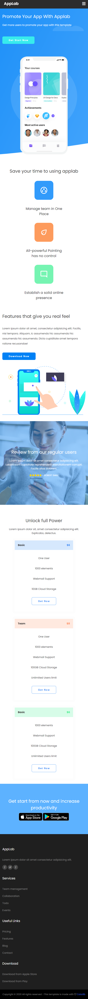
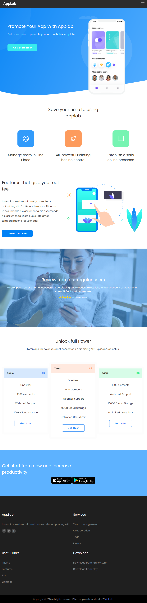
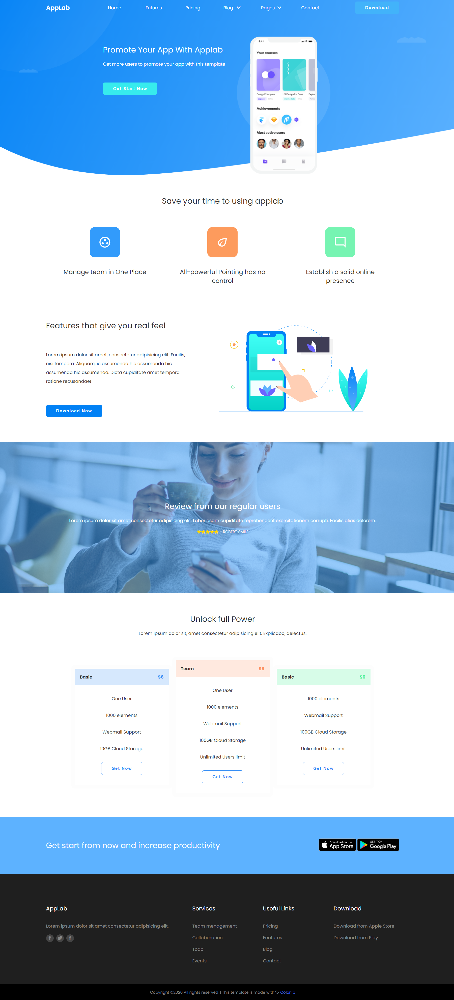

# HTML & CSS: RWD

## Table of contents

- [Overview](#overview)
  - [The challenge](#the-challenge)
  - [Links](#links)
  - [Screenshot](#screenshot)
- [My process](#my-process)
  - [Built with](#built-with)
  - [Useful resources](#useful-resources)
  - [Copyrights](#copyrights)
- [Author](#author)

## Overview 

### The-challenge

It was the one of the first challenge in my education process- that was built as a fully responsive website using Mobile-first workflow.

### Links

- Code: https://github.com/kowackag/html-and-css-rwd.git
- Live Site URL: https://kowackag.github.io/html-and-css-rwd/ 

### Screenshot

#### mobile 

#### tablet

#### desktop

## My process

### Built with

- Semantic HTML5 markup
- CSS custom properties
- Flexbox
- CSS Grid
- Mobile-first workflow

### Useful resources

Font used in project `Poppins`, [Google Font](https://fonts.google.com/specimen/Poppins).

Icons downloaded from [Font Awesome](https://fontawesome.com/).

### Copyrights
All copyrights belong to colorlib.com (https://colorlib.com).
The template may be used in accordance with the [license] (https://colorlib.com/wp/licence/).

## Author

- Małgorzata Kowacka
- GitHub - [kowackag](https://github.com/kowackag)
- Linked - [Małgorzata Kowacka](https://www.linkedin.com/in/ma%C5%82gorzata-kowacka-0258a812a/)